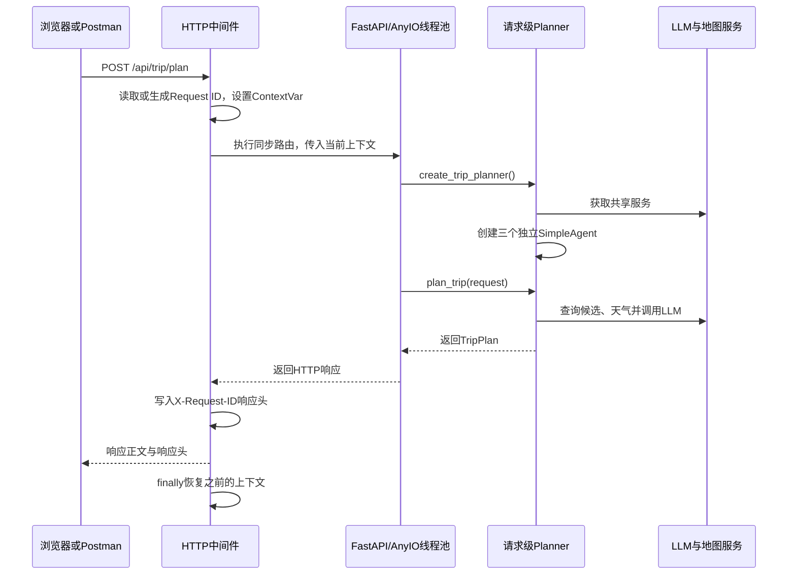

# 请求并发、Agent 上下文隔离与 Request ID 日志追踪学习指南

本文根据 2026-09-27 的项目工作区源码编写，记录本轮后端改造的设计与实现。内容以当前实现为准：已经实现的能力、暂未实现的能力和后续建议分别说明。

这不是一个单独的类，而是一组协作模块：FastAPI 负责分发请求，旅行规划器负责请求级 Agent 状态，共享服务负责基础设施复用，日志上下文负责标记每条业务日志所属的请求。

## 1. 这轮改造解决了什么问题

原先的规划接口使用 `async def`，内部却直接执行同步的 Agent、MCP 和 HTTP 调用。一次旅行规划等待外部服务时，可能阻塞当前 worker 的事件循环，让其他请求不能及时得到处理。

同时，原先的 `MultiAgentTripPlanner` 是全局单例，所有请求共享三个 `SimpleAgent`。当前安装的 HelloAgents 会读取 Agent 的 `_history`，并在调用结束后将输入和输出追加进去。因此，即使两个请求先后执行，后一个请求也可能携带前一个请求的历史；如果并发执行，还会发生共享状态竞争。

改成请求级 Planner 后，需要继续解决两件事：多个线程同时访问共享服务时，首次初始化不能重复执行；多个请求的日志交错输出时，需要能识别每条日志属于哪个请求。

本轮形成的组合是：

```text
同步规划路由 → 框架线程池
每请求创建 Planner → 每请求独立 Agent 历史
共享 LLM / 地图服务 → 初始化锁保护首次创建
HTTP 中间件 → ContextVar → 带 Request ID 的业务日志
```

## 2. 文件与职责

下列路径均相对于项目根目录。

| 文件 | 主要职责 |
| --- | --- |
| `backend/app/api/main.py` | 创建 FastAPI 应用、注册 Request ID 中间件、配置 CORS |
| `backend/app/api/routes/trip.py` | 接收规划请求、创建请求级 Planner、返回结果和业务错误 |
| `backend/app/agents/trip_planner_agent.py` | 创建三个 Agent、串行编排规划步骤、校验并回填可信数据 |
| `backend/app/services/llm_service.py` | 共享 LLM 客户端及其初始化锁 |
| `backend/app/services/amap_service.py` | 共享地图服务、MCPTool 及其初始化锁 |
| `backend/app/logging_context.py` | 定义 Request ID 上下文和 `log()` 包装函数 |
| `backend/run.py` | 开发环境启动入口，当前使用 `reload=True` |

建议阅读顺序：先看 `logging_context.py`，再看 `main.py` 的中间件，接着看 `trip.py`，最后看 Planner 和共享服务工厂。

## 3. 一次请求的完整生命周期



一个请求内部仍然按依赖顺序执行：景点候选获取与筛选、天气查询、酒店候选获取与筛选、最终行程生成、校验与数据回填。不同请求可以重叠执行，不代表一个请求内的三个 Agent 已改成并行调用。

## 4. 同步路由与线程池并发

### 4.1 为什么把规划路由改成 `def`

当前路由的关键结构为：

```python
def plan_trip(request: TripRequest):
    agent = create_trip_planner()
    trip_plan = agent.plan_trip(request)
    return TripPlanResponse(
        success=True,
        message="旅行计划生成成功",
        data=trip_plan,
    )
```

FastAPI 将普通同步路径函数交给线程池运行。当前本地 Starlette 的 `run_in_threadpool()` 委托给 `anyio.to_thread.run_sync()`。

因此等待外部服务的是工作线程，事件循环可以继续调度其他请求：

```text
Uvicorn worker 进程
├── 事件循环：处理连接、调度请求、等待线程池结果
├── 工作线程：运行用户 A 的同步规划路由
└── 工作线程：运行用户 B 的同步规划路由
```

线程由框架管理、可以复用，不是每个用户永久拥有一个线程，也不是每来一个请求就无限创建新线程。当线程池名额不足时，请求仍可能等待。

### 4.2 为什么只写 `async def` 不够

下面的形式依然会阻塞事件循环：

```python
async def plan_trip(request):
    return synchronous_planner.plan_trip(request)
```

`async def` 不会自动把同步函数变成非阻塞函数。同步调用返回前，当前协程没有机会通过异步等待让出执行权。

注意：普通函数被直接调用时，也不会自动进入线程池。这里能够进入线程池，是因为它作为 FastAPI 的同步路径函数被框架调度。

### 4.3 同步、串行、并发、并行分别是什么意思

| 概念 | 关注的问题 | 项目中的例子 |
| --- | --- | --- |
| 同步调用 | 调用者何时继续执行 | 等 `agent.run()` 返回后再执行下一行 |
| 串行执行 | 多个步骤的先后关系 | 先筛选景点，再基于景点筛选酒店 |
| 并发执行 | 多个任务的执行区间是否重叠 | A 等待 LLM 时，B 可以发起高德查询 |
| 并行执行 | 是否在同一瞬间实际运行 | 多核或多个进程同时进行计算 |

当前实现是“每次规划内部同步串行，不同规划请求在线程池中并发”。

### 4.4 GIL 与这个设计的关系

在启用 GIL 的常规 CPython 中，同一进程内通常只有一个线程执行 Python 字节码。GIL 会限制纯 Python CPU 密集计算的多核并行，但网络 I/O 等阻塞等待通常会释放 GIL。

本项目主要耗时在远程 LLM、高德服务和 MCP 响应等待，因此线程并发仍有价值。LLM 的推理主要发生在外部服务上，本地线程主要负责构造请求、等待和解析结果。

GIL 不会保护整段业务逻辑。它既不能保证单例只初始化一次，也不能防止 Agent 历史混入其他用户数据。因此请求级对象与显式初始化锁仍然必要。

## 5. 请求级 Planner 如何隔离 Agent 历史

### 5.1 当前工厂函数

```python
def create_trip_planner() -> MultiAgentTripPlanner:
    """为每次请求创建独立的旅行规划器。"""
    return MultiAgentTripPlanner()
```

每次调用 `MultiAgentTripPlanner()` 都会创建新对象，其构造函数再创建三个 `SimpleAgent`：

```text
请求 A：Planner A
├── AttractionAgent A → _history A1
├── HotelAgent A      → _history A2
└── PlannerAgent A    → _history A3

请求 B：Planner B
├── AttractionAgent B → _history B1
├── HotelAgent B      → _history B2
└── PlannerAgent B    → _history B3
```

当前安装的 `SimpleAgent.run()` 会把 `_history` 加入发送给 LLM 的消息列表，再追加本次用户输入和模型响应。创建独立 Agent，才能让这些历史分别归属于不同请求。

### 5.2 共享对象与私有对象

| 对象 | 生命周期 | 原因 |
| --- | --- | --- |
| `TripRequest` | 单次请求 | 用户输入属于本次调用 |
| `MultiAgentTripPlanner` | 单次请求 | 持有本次请求的 Agent |
| 三个 `SimpleAgent` 及其历史 | 单次请求 | 对话历史是可变用户状态 |
| 候选景点、候选酒店、天气和最终行程 | 单次函数调用 | 当前存放在局部变量中 |
| `HelloAgentsLLM` | 当前进程内共享 | 当前实现接收消息参数，不保存 Agent 对话历史 |
| `AmapService` / `MCPTool` | 当前进程内共享 | 当前服务未保存用户行程或对话状态 |
| 系统提示词、配置 | 共享 | 用作公共配置，运行期间不应按用户修改 |

共享客户端和共享对话历史是两件事。当前多个 Agent 可以使用同一个 LLM 客户端，但每次发送不同的消息列表。初始化锁只保护创建，不等于证明所有客户端方法都线程安全；以后更换库、添加缓存或修改实例配置时，需要重新检查共享状态。

当前安装的 MCPTool 在 `run()` 内使用新的 `MCPClient` 上下文执行操作。因此复用 MCPTool 不应被理解为复用了一个永久的 MCP 会话或子进程；实际连接与进程行为取决于当前依赖实现。

### 5.3 为什么清空共享历史不够

对全局 Agent 执行 `clear_history()`，不能隔离并发请求。A 正在运行时，B 可能清空或写入同一份历史。即使每次开始前清空，也无法让两个请求拥有独立状态。

给整个规划过程加锁可以串行化访问，但会让 A 完成后 B 才能开始。当前采用请求级对象，避免共享用户历史，同时保留不同请求的并发能力。

### 5.4 当前不提供跨请求的多轮会话

同一个用户第二次调用接口，也会得到新 Planner。前一次的 Agent 历史不会自动保留。

如果以后支持“修改上一份行程”，需要显式的 `trip_id` 或 `conversation_id`，并结合用户身份与数据库加载历史。Request ID 只用于追踪一次请求，不提供登录、用户身份认证或行程所有权检查。

## 6. 共享服务的初始化锁

### 6.1 锁解决冷启动竞态

没有锁时，A、B 可能同时看到全局实例为 `None`，各自创建客户端。构造过程中可能等待系统或网络，因此不能把“判断再赋值”视为不可分割的一步。

当前采用双重检查：

```python
_llm_instance = None
_llm_lock = Lock()

def get_llm() -> HelloAgentsLLM:
    global _llm_instance

    if _llm_instance is None:
        with _llm_lock:
            if _llm_instance is None:
                _llm_instance = HelloAgentsLLM()

    return _llm_instance
```

外层判断提供初始化完成后的快速路径；内层判断避免等待锁的线程重复初始化。构造失败时，赋值不会完成，实例仍然为 `None`，后续调用可以重试；`with` 会在异常时释放锁。

锁只在首次初始化时被持有，正常的 `agent.run()` 不在这把锁内，因此不会把整个规划过程变成串行。

### 6.2 高德服务为什么使用两把锁

```text
get_amap_service()
  获取 _amap_service_lock
  创建 AmapService()
    调用 get_amap_mcp_tool()
      获取 _amap_mcp_tool_lock
      创建 MCPTool
```

普通 `Lock` 不可重入，如果这两个地方使用同一把锁，当前线程就可能等待自己已经持有的锁。现在分别使用两把锁，避免这条初始化路径的自我死锁。

以后增加反向调用时，也要留意锁获取顺序。两个线程分别持有一把锁，再等待对方的锁，仍然可能死锁。

### 6.3 单例和锁只在当前进程中有效

多个 Uvicorn worker 有各自的进程内存，每个进程都有自己的 LLM、地图服务及锁。不是整个服务器只创建一份。

开发模式重新加载或重启后，全局变量也会重新初始化。查看“初始化成功”日志时，要区分同一个进程中的重复初始化和重启后正常初始化。

`reset_llm()` 当前也使用初始化锁，但它不会取消正在使用旧客户端的请求。它只重置工厂变量，不应被当成运行中所有请求的资源关闭机制。

## 7. Request ID 中间件

### 7.1 获取或生成 ID

当前 `main.py` 的规则是：

```python
request_id = (
    request.headers.get("X-Request-ID")
    or uuid4().hex[:12]
)
```

如果客户端提供非空 `X-Request-ID`，服务端沿用；否则生成 12 位十六进制字符串。自动生成的 ID 用于日常日志关联，不能当成严格保证唯一的数据库主键。客户端也可以重复发送同一个 ID。

### 7.2 设置、调用、回传、恢复

下例将当前实现的 `finally` 展开，便于阅读：

```python
token = set_request_id(request_id)

try:
    response = await call_next(request)
    response.headers["X-Request-ID"] = request_id
    return response
finally:
    reset_request_id(token)
```

`call_next()` 执行下游请求处理。同步规划路由由框架在线程池中运行，中间件在等待结果时可以让事件循环处理其他任务。

响应头让客户端可以把接口结果和后端日志关联起来。`finally` 保证正常结束或异常退出时，都恢复中间件所在上下文之前的值。

当前写入响应头的语句只有在 `call_next()` 返回响应后才执行。正常响应和由 FastAPI 转换为响应的业务异常可以经过这条路径；未经处理、直接向外传播的异常不保证带这个响应头。

### 7.3 CORS 中的 `expose_headers`

当前配置已有：

```python
expose_headers=["X-Request-ID"]
```

这使跨域浏览器 JavaScript 可以读取该响应头。它与允许客户端发送请求头的 `allow_headers` 作用不同。

Postman 不受浏览器同源策略限制，即使没有 `expose_headers` 也能查看响应头。不要用 Postman 能读到响应头，代替浏览器跨域配置验证。

## 8. ContextVar 如何隔离日志上下文

### 8.1 为什么不用普通全局字符串

```python
current_request_id = "user-a"
```

普通全局变量会被所有请求共同读写。B 把它改成 `user-b` 后，A 的日志也可能读到 B 的 ID。

`logging_context.py` 定义：

```python
_request_id: ContextVar[str] = ContextVar(
    "request_id",
    default="-",
)
```

`ContextVar` 对象可以是全局的，但其值跟随当前执行上下文。不同请求在自己的上下文中读取对应的值。

| 函数 | 作用 |
| --- | --- |
| `set_request_id(value)` | 设置当前值，返回保存旧状态的 token |
| `get_request_id()` | 读取当前上下文中的值 |
| `reset_request_id(token)` | 恢复设置前的值，而不是简单写入空字符串 |
| `log(message)` | 读取当前 ID，并打印带前缀的单条日志 |

### 8.2 为什么在线程池路由里也能读到 ID

不是所有新建线程都会自动继承 ContextVar。

当前 FastAPI/Starlette 调用 AnyIO 执行同步路由；本地 AnyIO 实现会通过 `copy_context()` 复制提交任务时的上下文，并在线程中通过 `context.run(...)` 执行函数。因此中间件设置的 ID 会进入规划路由及其普通下游调用。

```text
请求上下文 A：request_id=user-a
  → AnyIO 复制上下文
  → 工作线程执行 A 的同步路由
  → log() 读取 user-a

请求上下文 B：request_id=user-b
  → AnyIO 复制上下文
  → 工作线程执行 B 的同步路由
  → log() 读取 user-b
```

工作线程里的上下文修改通常不会反向更新中间件的上下文。token 也应在创建它的上下文中重置，不要传给另一线程执行 `reset()`。

以后自行使用 `threading.Thread` 或其他执行器时，需要显式传入 ID，或使用 `copy_context()` 传播上下文；不能直接套用框架线程池的行为。ContextVar 也不会自动传到 MCP 子进程或远程 LLM 服务。

### 8.3 目前日志格式与覆盖范围

```python
def log(message: str) -> None:
    print(f"[request_id={get_request_id()}] {message}")
```

示例：

```text
[request_id=user-a] 收到旅行规划请求
[request_id=user-b] 收到旅行规划请求
[request_id=user-a] 步骤1: 获取并筛选景点
[request_id=user-b] 步骤1: 获取并筛选景点
[request_id=user-a] 步骤2: 查询天气
```

当前路由和 Planner 关键阶段已调用 `log()`。初始化细节、部分结果输出、地图服务、LLM 服务以及第三方库仍有普通 `print()`，没有全部接入追踪。

`log()` 目前是打印包装函数，还没有日志级别、时间戳、日志文件轮转、统一异常堆栈或结构化字段。没有设置上下文的脚本调用，默认会输出 `[request_id=-]`。

一个字符串中如果有换行，只会在整条字符串开头添加一次前缀；拆开打印后续行时，需要分别调用 `log()` 才能保证每行都有 ID。

## 9. 手动验证步骤

以下步骤供后续自行验证。真实规划请求会调用 LLM 与高德服务，可能产生费用。单独检查健康接口无需生成行程。

### 9.1 启动后端

在 PowerShell 中：

```powershell
cd C:\Users\Deng\Desktop\helloagents-trip-planner\backend
.\venv\Scripts\python.exe run.py
```

保持后端终端运行；在 Postman 或另一个终端发送请求。

### 9.2 检查自动 Request ID

Postman 设置：

```text
GET http://127.0.0.1:8000/api/trip/health
不提供 X-Request-ID 请求头
```

应返回 `200`，正文为：

```json
{
  "status": "healthy",
  "service": "trip-planner"
}
```

点击下方响应区的 Headers，查找 `X-Request-ID`。上方 Headers 是请求头，两个区域不要混淆。再次发送时通常会得到不同的自动 ID。

健康接口当前不创建 Planner，也不调用业务 `log()`。因此响应头有 ID，不代表终端一定会打印带 ID 的健康日志。

### 9.3 检查自定义 Request ID

在 Postman 上方请求 Headers 添加并勾选：

```text
X-Request-ID: manual-check-001
```

再次发送，响应 Headers 应包含相同值。

PowerShell 的等效写法：

```powershell
$response = Invoke-WebRequest `
    -Headers @{ "X-Request-ID" = "manual-check-001" } `
    http://127.0.0.1:8000/api/trip/health

$response.Headers["X-Request-ID"]
```

### 9.4 检查两个规划请求的并发日志

在 Postman 创建两个 POST 请求，地址均为：

```text
http://127.0.0.1:8000/api/trip/plan
```

请求 A 使用 `X-Request-ID: user-a`，Body 选择 raw / JSON：

```json
{
  "city": "北京",
  "start_date": "2026-10-01",
  "end_date": "2026-10-01",
  "travel_days": 1,
  "transportation": "公共交通",
  "accommodation": "经济型酒店",
  "preferences": ["历史文化"],
  "free_text_input": "优先安排历史文化景点"
}
```

请求 B 使用 `X-Request-ID: user-b`，将城市改为上海，偏好改为适用的另一个值。日期是示例，实际使用时可以调整，但开始、结束日期跨度必须与 `travel_days` 一致。

先发送 A，等 A 仍在规划时发送 B。观察：

1. A 结束前，B 已打印“收到旅行规划请求”并进入规划步骤。
2. 关键日志分别带 `user-a`、`user-b`，允许交错。
3. 正常返回的 A、B 响应头分别保留自己的 ID。
4. 两份结果保持各自城市和需求。

仅观察两份结果没有混入其他需求，不能证明全部并发行为绝对安全；它是实用的手动检查。需要更严格保证时，再补充可重复的并发测试。

### 9.5 检查规划期间的健康响应

A 正在等待 LLM 时，另外发送 GET `/api/trip/health`。在系统未过载、线程池仍有名额时，应能及时返回，而不必等待 A 整份规划完成。

同步健康接口也使用框架线程池。线程池耗尽时，它仍可能排队；这项验证说明正常负载下的响应性，不代表任何负载下都立即返回。

### 9.6 检查 Agent 历史隔离，不调用模型

在 `backend` 目录运行 `.\venv\Scripts\python.exe`，进入 Python 后：

```python
from app.agents.trip_planner_agent import create_trip_planner
from hello_agents.core.message import Message

a = create_trip_planner()
b = create_trip_planner()

print(a is b)                                  # False
print(a.attraction_agent is b.attraction_agent) # False
print(a.hotel_agent is b.hotel_agent)           # False
print(a.planner_agent is b.planner_agent)       # False

a.attraction_agent.add_message(Message("A的独立消息", "user"))
print(a.attraction_agent.get_history())        # 包含A的消息
print(b.attraction_agent.get_history())        # []
```

这一步会构造 LLM 客户端，需要相应配置，但不会调用 `run()` 发起模型推理。

### 9.7 检查共享服务冷启动

完全重启后端，在同一进程内同时提交两个规划请求：

```text
LLM服务初始化成功                预期一次
高德地图MCP工具初始化成功        预期一次
开始初始化多智能体旅行规划系统    每个请求各一次
```

MCP 服务端自身输出可能多次出现，因为 MCPTool 的一次初始化不等于只创建一次 MCPClient 或外部进程。

## 10. 常见现象与排查

| 现象 | 优先检查 |
| --- | --- |
| 响应没有 `X-Request-ID` | 是否重启；中间件是否注册；是否执行了设置响应头的语句 |
| 健康响应有 ID，但终端没有带 ID 的健康日志 | 健康路由没有调用 `log()`，属于当前实现行为 |
| 路由日志有 ID，某些其他日志没有 | 那些日志可能仍是 `print()` 或第三方库输出 |
| `log()` 输出 `request_id=-` | 是否从 HTTP 请求外调用；是否自行创建线程却没有传播上下文 |
| 两个请求 ID 一样 | 客户端是否复用了同一请求头；当前服务端接受客户端提供的值 |
| B 等到 A 结束才开始 | 路由是否仍是 `async def` 直接调用同步函数；是否有全局规划锁；线程池是否耗尽 |
| 多份结果混入其他用户历史 | 工厂是否返回单例；是否共享 Agent；是否把用户数据存进全局变量 |
| 服务重启后又打印初始化日志 | 进程内单例已重建，属于正常现象 |
| 多 worker 各打印一份初始化日志 | 每个进程拥有自己的单例和锁，属于正常现象 |

## 11. 当前能力边界与后续方向

已经实现的能力：同步规划路由在线程池运行；每个请求拥有独立 Planner 和 Agent 历史；共享服务首次初始化受锁保护；HTTP 请求获得 Request ID；主要业务阶段日志带 ID；响应头回传 ID，并通过 CORS 暴露给浏览器。

目前尚未实现：完整日志框架、所有日志统一追踪、任务持久化、真实进度查询、显式规划并发上限、登录与用户级行程访问控制。

线程池存在框架自身的容量约束，但它不是旅行规划专用的限流策略。当前没有新增“最多同时执行 N 份行程”的业务限制；这是之前决定暂缓的工作。

Request ID 不负责 Agent 历史隔离。历史隔离依赖请求级 Agent；日志隔离依赖 ContextVar；首次初始化保护依赖 Lock。三者各自解决不同问题，不能相互替代。

同步工作线程开始运行后，客户端断开或请求超时不意味着该线程中的 LLM/MCP 调用会立刻取消。后续采用后台任务、超时策略和任务状态管理时，需要单独设计取消和清理。

后续可按需求推进：先统一剩余业务日志并记录耗时；再根据访问量增加并发限制；需要真实进度和重新查询结果时，引入后台任务及存储；需要持续编辑行程时，设计用户身份与行程会话模型。

## 12. 本地源码学习入口

除项目文件外，本说明核对过当前安装依赖的以下实现。它们位于虚拟环境，供阅读理解，不要直接修改依赖源码：

- `backend/venv/Lib/site-packages/hello_agents/agents/simple_agent.py`：`run()` 读取并追加 `_history`。
- `backend/venv/Lib/site-packages/hello_agents/core/agent.py`：Agent 历史的初始化、读取和清空。
- `backend/venv/Lib/site-packages/starlette/concurrency.py`：线程池调度委托给 AnyIO。
- `backend/venv/Lib/site-packages/anyio/_backends/_asyncio.py`：复制 Context 并在工作线程中执行。
- `backend/venv/Lib/site-packages/hello_agents/tools/builtin/protocol_tools.py`：MCPTool 每次操作创建 MCPClient 上下文。

依赖升级后，重新核对这些行为，尤其是历史保存、线程池上下文传播和共享客户端状态。
