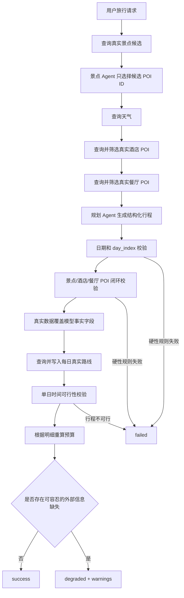

# 旅行计划可靠性校验与可信数据闭环学习指南

本文记录 2026-09-27 完成的旅行计划可靠性改造，涵盖日期连续性、三餐约束、预算汇总、餐厅 POI 可信闭环、真实路线写入、单日可行性判断，以及 `success/degraded/failed` 状态设计。

这轮改造的核心思想是：**让大模型负责推荐和表达，让后端程序负责事实、规则和计算。**

大模型可以决定“为什么推荐这家餐厅”“当天的行程如何描述”，但不应该独立决定 POI 是否真实、日期是否连续、预算加法是否正确，或一天的时间是否足够。这些内容都应该由确定性的程序校验。

## 1. 改造目标

本轮完成了以下七项能力：

1. 每天的日期必须与请求日期连续，`day_index` 必须从 0 开始连续；
2. 每天必须且只能包含早餐、午餐、晚餐各一次；
3. 预算必须根据行程明细重新加总；
4. 餐厅必须来自真实高德候选 POI，形成可信数据闭环；
5. 高德返回的真实路线必须写入 `DayPlan`；
6. 使用景点游览时间、路线耗时和用餐预留时间判断单日行程是否可行；
7. 对外明确区分 `success`、`degraded` 和 `failed`。

完整处理流程如下：



## 2. 涉及的主要文件

| 文件 | 作用 |
| --- | --- |
| `backend/app/models/schemas.py` | 定义餐厅筛选、路线、状态和预算约束的数据模型 |
| `backend/app/agents/trip_planner_agent.py` | 编排餐厅闭环、业务校验、路线查询、预算重算和状态判断 |
| `backend/app/api/routes/trip.py` | 将计划状态和警告返回给前端，将业务异常映射为 `failed` |
| `backend/app/config.py` | 配置每日可用时间和用餐预留时间 |
| `backend/.env.example` | 提供时间配置示例 |
| `frontend/src/types/index.ts` | 同步后端新增的状态、餐厅 POI 和路线类型 |
| `frontend/src/views/Home.vue` | 对降级结果显示提示 |
| `frontend/src/views/Result.vue` | 在结果页展示降级原因 |
| `backend/tests/test_plan_integrity.py` | 覆盖本轮新增可靠性规则 |
| `backend/tests/test_request_concurrency.py` | 验证成功、降级和失败状态的 API 输出 |

## 3. 日期和 `day_index` 连续性

请求模型原本已经校验了 `start_date`、`end_date` 和 `travel_days` 的关系，但规划 Agent 仍可能返回：

- 日期重复；
- 中间跳过一天；
- `day_index` 从 1 开始；
- 日期正确但顺序错误。

因此，最终计划还需要再次和原始请求对照。

关键算法是：

```python
expected_start = date.fromisoformat(request.start_date)

for expected_index, day_plan in enumerate(trip_plan.days):
    if day_plan.day_index != expected_index:
        raise PlanValidationError("day_index不连续")

    expected_date = (
        expected_start + timedelta(days=expected_index)
    ).isoformat()

    if day_plan.date != expected_date:
        raise PlanValidationError("行程日期不连续")
```

这里没有尝试“猜测并修复”模型返回的日期。日期属于用户请求中的硬约束，如果不一致，说明模型没有正确遵守请求，因此直接失败更安全。

## 4. 早、中、晚餐约束

### 4.1 数据模型约束

`Meal.type` 不再接受任意字符串或 `snack`，而是限制为：

```python
Literal["breakfast", "lunch", "dinner"]
```

同时，每个餐饮项目必须包含真实餐厅的 `poi_id`：

```python
class Meal(BaseModel):
    poi_id: str
    type: Literal["breakfast", "lunch", "dinner"]
    estimated_cost: int = Field(default=0, ge=0)
```

`Literal` 只能保证单条记录的值合法，不能保证一天恰好有三条，也不能阻止两个 `lunch`。因此还要进行集合级校验：

```python
required_types = {"breakfast", "lunch", "dinner"}
meal_types = [meal.type for meal in day.meals]

if len(meal_types) != 3 or set(meal_types) != required_types:
    raise PlanValidationError(
        "每天必须且只能包含早、中、晚餐各一次"
    )
```

这里同时验证长度和集合：

- 只验证集合，四顿饭中包含三种类型也可能错误通过；
- 只验证长度，三个 `lunch` 也可能错误通过；
- 两者组合才能表达“恰好各一次”。

当前实现还要求同一天三餐不能使用同一家餐厅。不同日期可以重复使用餐厅。

## 5. 餐厅 POI 可信闭环

### 5.1 什么是可信闭环

餐厅信息使用和景点、酒店相同的闭环模式：

```text
高德真实候选
  → 餐厅 Agent 只返回候选 poi_id 和推荐理由
  → 后端检查重复 ID、未知 ID、选择数量
  → 规划 Agent 只能使用筛选后的 poi_id
  → 后端再次检查计划中的 poi_id
  → 使用高德原始数据覆盖名称、地址和坐标
```

整个过程中，大模型只拥有“选择权”和“解释权”，没有“创造事实的权力”。

### 5.2 餐厅筛选 Agent

新增 `RESTAURANT_AGENT_PROMPT` 和 `RestaurantSelection`：

```python
class RankedRestaurant(BaseModel):
    poi_id: str
    reason: str


class RestaurantSelection(BaseModel):
    restaurants: List[RankedRestaurant]
```

餐厅 Agent 从高德返回的候选中选择 3 至 10 家。后端随后验证：

1. 至少选择 3 家；
2. 最多选择 10 家；
3. 不允许重复 `poi_id`；
4. 每个 `poi_id` 必须存在于高德候选集合。

### 5.3 为什么需要两次 ID 校验

第一次校验发生在餐厅 Agent 输出之后，用来防止筛选 Agent 创建不存在的 ID。

第二次校验发生在最终规划 Agent 输出之后，用来防止规划 Agent 绕过餐厅筛选结果。

只有两次校验都通过，最终计划中的餐厅才真正属于可信集合。

### 5.4 真实数据覆盖

最终规划 Agent 可能返回正确的 `poi_id`，但修改了餐厅名称或地址。因此后端不会信任这些事实字段，而是重新覆盖：

```python
source = candidate_restaurant_by_id[meal.poi_id]
meal.name = source.name
meal.address = source.address
meal.location = source.location.model_copy(deep=True)
meal.description = restaurant_reason_by_id[meal.poi_id]
```

其中：

- 名称、地址、坐标来自高德；
- 推荐理由来自餐厅筛选 Agent；
- 用餐类型和费用来自规划 Agent，但要经过类型和非负校验。

## 6. 预算加总校验

预算是典型的确定性计算，不适合交给大模型作为最终权威结果。

当前实现要求计划必须包含预算对象，然后根据最终行程明细重新计算：

```python
attractions = sum(
    attraction.ticket_price
    for day in trip_plan.days
    for attraction in day.attractions
)

hotels = sum(
    day.hotel.estimated_cost
    for day in trip_plan.days
    if day.hotel is not None
)

meals = sum(
    meal.estimated_cost
    for day in trip_plan.days
    for meal in day.meals
)

transportation = trip_plan.budget.total_transportation
total = attractions + hotels + meals + transportation
```

随后覆盖模型返回的汇总字段。这样即使模型将 `100 + 300 + 120 + 100` 错算成其他数字，API 最终返回的仍是 `620`。

所有预算字段还增加了 `ge=0`，因此负数会在 Pydantic 结构校验阶段被拒绝。

需要注意：当前改造保证的是**算术一致性**，不是价格实时真实性。景点门票、酒店费用和餐费仍然是估算值。如果后续需要更高可信度，可以接入价格接口或建立价格区间模型。

## 7. 将真实路线写入 `DayPlan`

### 7.1 路线数据结构

新增 `TravelLeg`：

```python
class TravelLeg(BaseModel):
    origin_poi_id: str
    origin_name: str
    destination_poi_id: str
    destination_name: str
    distance: float
    duration: int
    route_type: Literal["walking", "driving", "transit"]
    description: str
```

并在 `DayPlan` 中增加：

```python
travel_legs: List[TravelLeg] = Field(default_factory=list)
```

路线距离使用米，耗时使用秒，与高德服务层的 `RouteInfo` 保持一致。

### 7.2 每日路线顺序

当前路线链为：

```text
酒店 → 第一个景点 → 第二个景点 → 可选第三个景点 → 酒店
```

如果一天有两个景点，则应有三段路线；如果有三个景点，则应有四段路线。

使用 `zip(stops, stops[1:])` 可以自然构造相邻站点：

```python
stops = [day.hotel, *day.attractions, day.hotel]

for origin, destination in zip(stops, stops[1:]):
    route = amap_service.plan_route(...)
```

这种写法比手动处理第一段、中间段和返程更简单，也更不容易出现边界错误。

### 7.3 交通方式映射

用户输入会映射为高德服务支持的类型：

| 用户交通偏好 | 路线类型 |
| --- | --- |
| 包含“自驾”或“驾车” | `driving` |
| 包含“步行” | `walking` |
| 其他，包括“公共交通”和“混合” | `transit` |

“混合”目前退化为公共交通。如果以后需要真正的混合交通，可以根据单段距离动态选择步行、公交或驾车。

## 8. 单日行程可行性判断

当一天的所有路线都查询成功时，后端使用下面的时间模型：

```text
当天所需分钟数
= 所有景点游览分钟数
+ 所有路线耗时分钟数
+ 三餐预留分钟数
```

路线耗时从秒转换为分钟时向上取整：

```python
route_minutes = sum(
    ceil(leg.duration / 60)
    for leg in day.travel_legs
)
```

默认配置：

```env
DAILY_AVAILABLE_MINUTES=720
DAILY_MEAL_BUFFER_MINUTES=180
```

也就是每天最多使用 12 小时，其中三餐总计预留 3 小时。

如果计算结果超过每日可用时间，后端抛出 `PlanValidationError`，计划状态为失败。这属于硬性业务问题，因为即使 POI 都是真实的，一个时间上无法完成的行程仍然不是可靠计划。

### 8.1 为什么路线缺失时不直接判定不可行

如果某一段路线查询失败，当前系统无法准确计算总路线时间。此时直接认定行程不可行没有充分证据，直接认定可行也不可靠。

因此当前策略是：

- 保存已经成功查询到的路线；
- 添加“无法完整校验时间可行性”的 warning；
- 将计划状态设置为 `degraded`；
- 不执行完整时间阈值判断。

这是“未知”和“错误”的区别：路线数据缺失表示无法判断，不等于已经确认不可行。

## 9. `success/degraded/failed` 状态设计

### 9.1 三种状态的含义

| 状态 | HTTP 行为 | 含义 | 典型情况 |
| --- | --- | --- | --- |
| `success` | 返回计划 | 所有核心和辅助数据完整 | 日期、POI、路线、预算均通过 |
| `degraded` | 返回计划和 warnings | 核心计划可用，但部分辅助数据缺失 | 天气失败、部分路线失败 |
| `failed` | 返回错误响应 | 核心可靠性无法保证 | 日期错误、未知 POI、三餐错误、行程不可行 |

`TripPlan` 本身只允许 `success` 和 `degraded`，因为失败时不会返回一个看似可用的计划对象。

`TripPlanResponse` 支持全部三种状态：

```python
status: Literal["success", "degraded", "failed"]
warnings: List[str]
```

### 9.2 降级结果为什么仍然 `success=True`

对于 `degraded`，接口仍返回 `success=True`，表示请求完成并产生了可展示的计划；同时通过 `status="degraded"` 和 `warnings` 告诉调用方信息不完整。

因此前端判断不能只看 `success`，还需要读取 `status`：

```typescript
if (response.status === 'degraded') {
  message.warning(response.warnings.join('；'))
}
```

### 9.3 失败响应

业务异常仍使用合适的 HTTP 状态码，例如：

- 外部服务不可用：503；
- Agent 输出结构错误：502；
- 行程可靠性校验失败：502；
- 内部未知错误：500；
- 并发容量已满：429。

这些错误响应的 `detail` 中统一增加：

```json
{
  "status": "failed",
  "code": "PLAN_VALIDATION_FAILED",
  "message": "生成的行程未通过可靠性校验，请重新生成"
}
```

## 10. 自动化测试

新增的 `backend/tests/test_plan_integrity.py` 不访问真实大模型或高德接口，而是直接测试确定性的业务规则。

覆盖内容包括：

- 合法日期和连续 `day_index` 通过；
- 跳号的 `day_index` 被拒绝；
- 不连续日期被拒绝；
- 每天必须有三种餐型；
- 餐厅名称、地址和坐标由可信 POI 覆盖；
- 预算根据明细重新计算；
- 真实路线结果写入 `DayPlan.travel_legs`；
- 部分路线失败会产生降级警告；
- 路线耗时过长会判定单日不可行；
- API 正确返回 `success`、`degraded` 和 `failed`。

在项目中运行后端测试：

```powershell
cd backend
.\venv\Scripts\python.exe -m pytest -q
```

本轮完成时的结果是：

```text
32 passed
```

运行前端类型检查和生产构建：

```powershell
cd frontend
npm exec vue-tsc -- --noEmit
npm run build
```

构建已经通过。Vite 会提示主 JavaScript chunk 超过 500 kB，这是性能优化提醒，不是本轮功能错误。

## 11. 为什么测试使用 Fake Route Service

路线规则测试使用本地替身返回固定的 `RouteInfo`：

```python
class FakeRouteService:
    def plan_route(self, **kwargs):
        return RouteInfo(
            distance=1000,
            duration=600,
            route_type=kwargs["route_type"],
            description="真实路线",
        )
```

这样做有几个好处：

1. 测试结果不受网络波动影响；
2. 不消耗高德 API 配额；
3. 可以精确构造路线失败和超时场景；
4. 测试速度快，适合每次提交时运行。

但本地替身不能证明高德线上接口永远可用。因此上线前还应保留少量集成测试，用真实测试账号执行一条完整规划请求。

## 12. 这套实现的边界

当前实现已经建立了可靠性基础，但仍有以下边界：

### 12.1 路线暂未包含餐厅站点

路线目前按照酒店和景点生成，没有将三家餐厅插入路线顺序。这样可以避免规划 Agent 随意安排用餐时刻，但路线耗时会低估绕行餐厅的时间。

后续可以为 `DayPlan` 引入统一的时间线节点：

```text
酒店 → 早餐 → 景点A → 午餐 → 景点B → 晚餐 → 酒店
```

然后对所有相邻节点查询路线。

### 12.2 没有校验营业时间

当前可行性只判断总时长，没有判断：

- 景点开放时间；
- 博物馆闭馆日；
- 餐厅营业时间；
- 最晚入园时间。

如果高德或其他数据源能够提供营业时间，可以把“总时长校验”升级为带时间窗的排程问题。

### 12.3 价格仍是估算值

预算加法已经可信，但单项价格不是实时订单价格。更成熟的设计应该区分：

- `estimated_cost`：估算；
- `verified_price`：外部服务确认价格；
- `price_checked_at`：查询时间；
- `currency`：货币单位。

### 12.4 路线失败的重试策略

当前单段路线失败后直接进入降级状态。后续可以增加：

1. 短暂重试一次；
2. 公交失败时尝试驾车或步行；
3. 缓存相同起终点的路线结果；
4. 记录失败类型，区分超时、地址无法解析和服务限流。

## 13. 推荐的后续学习顺序

建议按下面顺序阅读和实验：

1. 阅读 `schemas.py`，理解 Pydantic 如何限制单条数据结构；
2. 阅读 `_validate_plan_against_request()`，理解跨对象业务校验；
3. 阅读 `_validate_and_hydrate_meals()`，理解 POI 可信闭环；
4. 阅读 `_populate_routes_and_validate_feasibility()`，理解外部数据、降级和确定性计算；
5. 阅读 `_normalize_and_validate_budget()`，理解为什么计算不应交给 LLM；
6. 阅读 `trip.py`，理解领域状态如何映射到 HTTP 响应；
7. 阅读 `test_plan_integrity.py`，尝试增加新的边界测试。

可以自行完成的练习包括：

- 增加“预算不能超过用户预算上限”的请求字段和测试；
- 把餐厅插入路线时间线；
- 增加每段路线最大耗时限制；
- 为 `degraded` warning 定义结构化错误码；
- 增加一条模拟完整 Agent 输出的端到端测试；
- 将每天 720 分钟改为根据用户出发、结束时间动态计算。

## 14. 总结

这轮改造不是简单地在提示词中增加几句话，而是把旅行规划拆成三个责任层：

```text
外部数据源：提供真实 POI、天气和路线
Agent：负责选择、排序、理由和自然语言表达
确定性后端：负责身份校验、约束、计算、状态和错误处理
```

对于 Agent 项目，可靠性通常不是来自“更长的提示词”，而是来自：

- 结构化输出；
- 候选集合约束；
- ID 闭环；
- 可信字段覆盖；
- 确定性计算；
- 明确的失败与降级语义；
- 能重复运行的自动化测试。

这也是本项目从演示型 Agent 应用走向可解释、可测试工程项目的关键一步。
